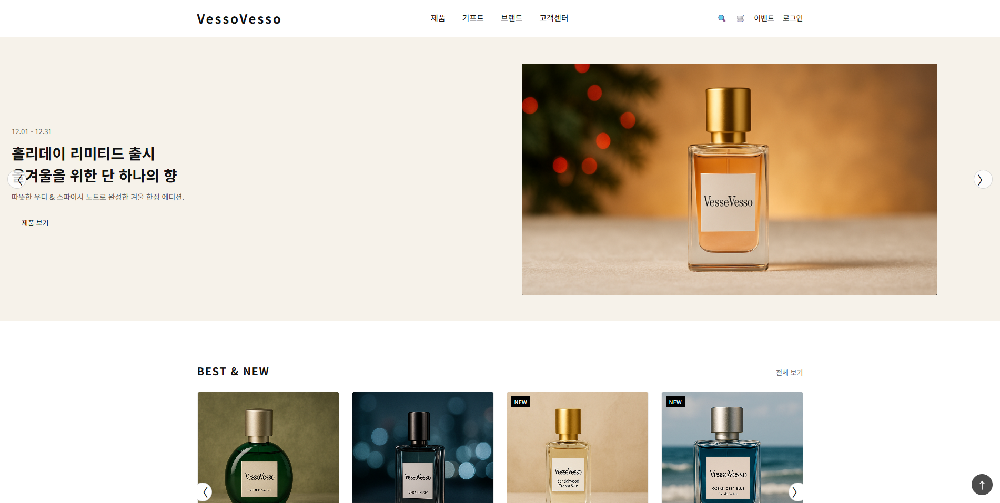
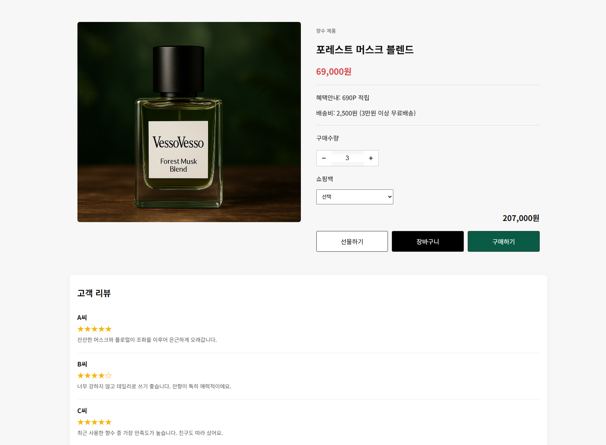
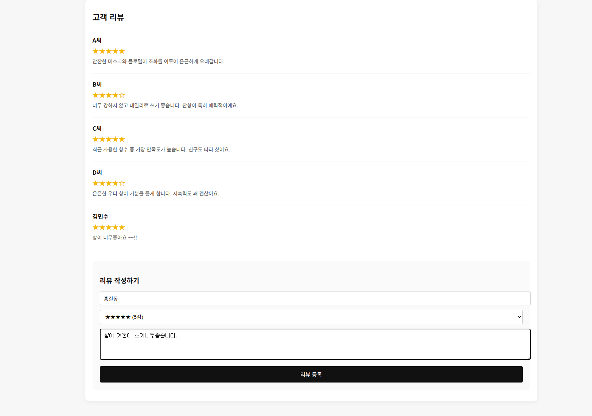

# VessoVesso Perfume Shop

향수 브랜드를 콘셉트로 제작한 1인 웹 프로젝트입니다.  
메인 배너, 상품 리스트, 상품 상세페이지, 수량 선택, 리뷰 작성 기능을 포함한 정적 쇼핑몰 웹사이트입니다.

## 화면 미리보기

### 메인 페이지

### 상품 상세 페이지

### 리뷰 작성 기능

## 프로젝트 개요

- 프로젝트명: VessoVesso
- 제작 형태: 개인 프로젝트
- 제작 목적: HTML, CSS, JavaScript를 활용한 쇼핑몰 UI 구현
- 주요 주제: 향수 브랜드 온라인 스토어
- 사용 기술: HTML, CSS, JavaScript

## 주요 기능

- 고정형 헤더 및 네비게이션 메뉴
- 제품 카테고리 메가 메뉴
- 검색 오버레이 UI
- 메인 자동 슬라이드 배너
- BEST & NEW 상품 슬라이더
- 상품 상세페이지 이동
- URL 파라미터 기반 상품 정보 출력
- 상품 수량 변경 및 총액 계산
- 리뷰 작성 및 화면 추가 기능
- 반응형 웹 레이아웃

## 주요 화면

### 메인 페이지
- 브랜드 메인 배너
- BEST & NEW 상품 영역
- 브랜드 스토리 영역

### 상품 상세 페이지
- 상품 이미지
- 상품명 및 가격 표시
- 할인율 표시
- 수량 선택
- 적립 포인트 안내
- 리뷰 작성 기능

## 구현 포인트

이 프로젝트는 실제 향수 쇼핑몰 UI를 참고하여 제작했습니다.  
상품 목록과 상세페이지를 분리하고, URL 파라미터를 활용해 상품별 상세 정보를 다르게 표시하도록 구현했습니다.

또한 JavaScript를 활용하여 슬라이더, 수량 계산, 리뷰 등록 기능을 직접 구현했습니다.

## 실행 방법

1. 프로젝트 파일을 다운로드합니다.
2. `index.html` 파일을 브라우저에서 실행합니다.
3. 상품을 클릭하면 `product-detail.html` 상세페이지로 이동합니다.

## 향후 개선 사항

- 장바구니 기능 고도화
- 로그인/회원가입 페이지 추가
- localStorage를 활용한 리뷰 저장
- 결제 페이지 UI 추가
- React 기반 컴포넌트 구조로 리팩토링